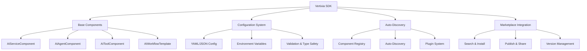

# Vertixia SDK

  

**Official Python SDK for Vertixia AI OS** - Build intelligent AI components, agents, and workflows for the Vertixia platform.

## 🚀 Quick Start

### Installation

```bash
# Install from PyPI
pip install vertixia-sdk

# Or with all optional dependencies
pip install vertixia-sdk[all]

# Development installation
git clone https://github.com/vertixia/vertixia-sdk.git
cd vertixia-sdk
pip install -e .[dev]
```

### Create Your First Component

```python
from vertixia_sdk import AIToolComponent

class TextAnalyzer(AIToolComponent):
    """Intelligent text analysis component"""
    
    def __init__(self):
        super().__init__(
            name="text-analyzer",
            description="Advanced text analysis with sentiment detection"
        )
    
    def execute(self, text: str) -> dict:
        # Your component logic here
        return {
            "sentiment": "positive",
            "keywords": ["AI", "automation"],
            "summary": "AI-powered text analysis"
        }

# Register and use
analyzer = TextAnalyzer()
result = analyzer.execute("Vertixia AI OS is amazing!")
print(result)
```

### CLI Usage

```bash
# Create a new component
vertixia component create --name my-agent --type agent

# Validate component configuration
vertixia component validate my-agent.yaml

# Test component locally
vertixia component test my-agent.yaml --input "Hello World"

# Publish to marketplace
vertixia marketplace publish my-agent.yaml --public
```

## 🧠 Component Types

| Type | Description | Use Cases |
|------|-------------|-----------|
| **AIServiceComponent** | Base service functionality | APIs, utilities, data processing |
| **AIAgentComponent** | Autonomous goal-oriented agents | Task automation, decision making |
| **AIToolComponent** | Reusable tools with validation | Data transformation, external APIs |
| **AIWorkflowTemplate** | Multi-step process orchestration | Complex pipelines, business processes |
| **AIAutomationComponent** | Scheduled and triggered operations | Monitoring, batch processing |
| **AIIntelligenceComponent** | AI/ML model integration | Inference, training, evaluation |

## 📖 Documentation

- **[Getting Started](https://docs.vertixia.ai/sdk/getting-started)** - Your first component in 5 minutes
- **[Component Development](https://docs.vertixia.ai/sdk/components)** - Build powerful AI components
- **[API Reference](https://docs.vertixia.ai/sdk/api)** - Complete SDK documentation
- **[Examples](./examples/)** - Real-world component examples
- **[Marketplace Guide](https://docs.vertixia.ai/sdk/marketplace)** - Publish and share components

## 🏗️ Architecture



## 🎯 Key Features

### Configuration-Driven Development
- **YAML/JSON Configuration**: Define components declaratively
- **Environment Integration**: Seamless deployment configuration
- **Type Safety**: Built-in validation with Pydantic
- **Auto-Discovery**: Automatic component registration

### Marketplace Integration
- **Publish Components**: Share with the Vertixia community
- **Discover & Install**: Find components for any use case
- **Version Management**: Semantic versioning and compatibility
- **Quality Assurance**: Verified components with ratings

### Developer Experience
- **Rich CLI**: Complete command-line toolkit
- **Hot Reload**: Development mode with instant updates
- **Testing Framework**: Built-in testing and validation
- **Documentation**: Auto-generated docs and examples

## 🔧 Advanced Usage

### Custom Agent Development

```python
from vertixia_sdk import AIAgentComponent
from vertixia_sdk.config import AgentConfig

class EmailAgent(AIAgentComponent):
    """Intelligent email processing agent"""
    
    def __init__(self):
        config = AgentConfig(
            name="email-agent",
            description="Process and respond to emails intelligently",
            capabilities=["email_processing", "sentiment_analysis", "auto_response"],
            reasoning_engine="iterative_transparent"
        )
        super().__init__(config)
    
    async def execute_task(self, task: dict) -> dict:
        # Multi-step email processing logic
        emails = await self.fetch_emails(task['query'])
        analysis = await self.analyze_sentiment(emails)
        responses = await self.generate_responses(analysis)
        
        return {
            "emails_processed": len(emails),
            "sentiment_distribution": analysis,
            "auto_responses": responses
        }
```

### Workflow Orchestration

```python
from vertixia_sdk import AIWorkflowTemplate

class DataPipeline(AIWorkflowTemplate):
    """Multi-step data processing workflow"""
    
    def define_workflow(self):
        return {
            "steps": [
                {"component": "data-extractor", "input": "source_url"},
                {"component": "data-transformer", "input": "raw_data"},
                {"component": "ai-analyzer", "input": "clean_data"},
                {"component": "report-generator", "input": "analysis_results"}
            ],
            "error_handling": "retry_with_backoff",
            "parallel_execution": True
        }
```

## 🌟 Examples

### Text Processing Component
```python
# examples/text_processor.py
from vertixia_sdk import AIToolComponent

class AdvancedTextProcessor(AIToolComponent):
    def execute(self, text: str, operations: list) -> dict:
        results = {}
        for op in operations:
            if op == "summarize":
                results[op] = self.summarize_text(text)
            elif op == "extract_entities":
                results[op] = self.extract_entities(text)
        return results
```

### Automation Component
```python
# examples/scheduler.py
from vertixia_sdk import AIAutomationComponent

class TaskScheduler(AIAutomationComponent):
    def setup_triggers(self):
        return [
            {"type": "cron", "schedule": "0 9 * * *", "action": "daily_report"},
            {"type": "webhook", "endpoint": "/trigger", "action": "process_data"}
        ]
```

## 🤝 Contributing

We welcome contributions! Please see our [Contributing Guide](CONTRIBUTING.md) for details.

### Development Setup

```bash
# Clone the repository
git clone https://github.com/vertixia/vertixia-sdk.git
cd vertixia-sdk

# Install dependencies
pip install -e .[dev]

# Install pre-commit hooks
pre-commit install

# Run tests
pytest

# Code formatting
black .
ruff check --fix .
```

## 📋 Requirements

- **Python**: 3.10+ (3.11+ recommended)
- **Dependencies**: Listed in `pyproject.toml`
- **Vertixia AI OS**: Compatible with v1.0+ (for runtime integration)

## 📄 License

This project is licensed under the MIT License - see the [LICENSE](LICENSE) file for details.

## 🔗 Links

- **Website**: [vertixia.ai](https://vertixia.ai)
- **Documentation**: [docs.vertixia.ai](https://docs.vertixia.ai)
- **Community**: [GitHub Discussions](https://github.com/vertixia/vertixia-sdk/discussions)
- **Support**: [support@vertixia.ai](mailto:support@vertixia.ai)

## 🏷️ Badges


---

**Built with ❤️ by the Vertixia team**

*Empowering developers to build the next generation of intelligent applications*